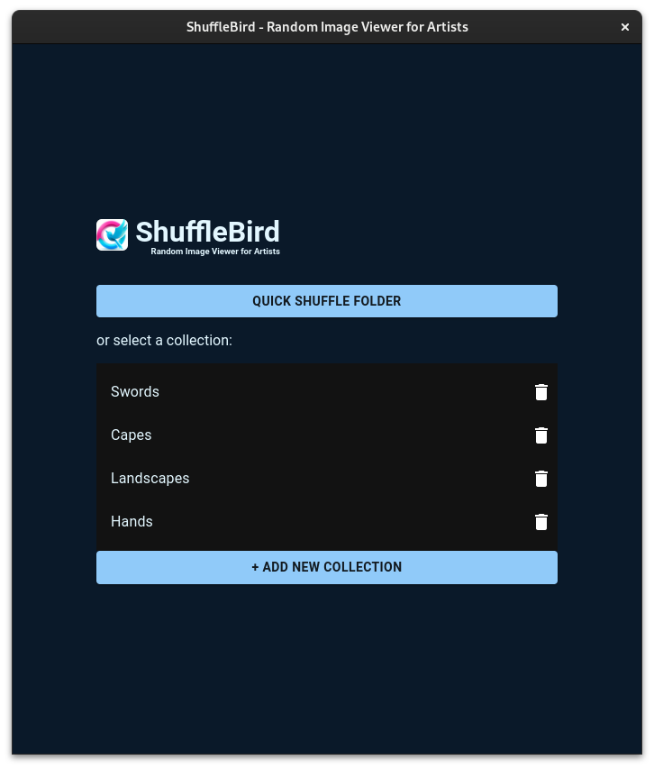

# ShuffleBird 
A random image viewer tool for artists that will display a slideshow of random images from a folder(or collection of folders) at set intervals.

I was using [quickposes.com](https://quickposes.com) and [line-of-action.com](https://line-of-action.com/) but I needed to have timed images with my own local collections (weapons, capes and other stuff I want to study). I couldn't find one, so I created my own with the same options to shuffle and display random images but from a local folder or create collections with set folders.

  

  

Left/right arrows can be used to go to previous/next image, space to pause/resume, Esc to stop the slideshow.

## Download
macOS & Windows setup/portable version on [Release Page](https://github.com/PuffedUpBirdie/ShuffleBird/releases).

## Issues, Feedback and further changes.
### On MacOS
On MacOS, you'll get a error saying that `"ShuffleBird" is damaged and can't be opened. You should move it to the Trash.` - This is their misleading way of telling that you're downloading a unsigned application from the internet, so to solve this you'll have to open a terminal in the location where the unziped ShuffleBird is and run `xattr -c ShuffleBird.app`. To solve this form my side would be to pay Apple 99$/year and sign it, which I don't want to do for a simple hobby project.

If you find other issues, would like to requests some additional changes or would like to request any other tool that could be used by an artist, try to create a new issue here and let me know.

